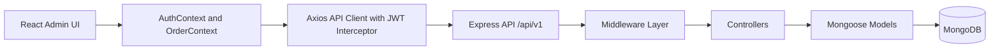
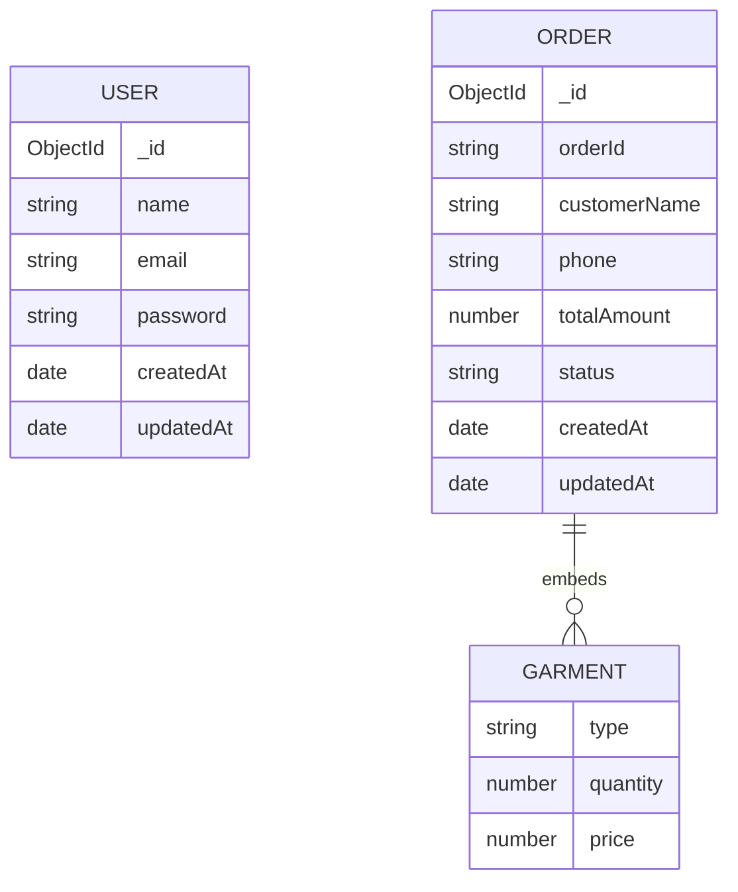

# Laundry Management System


A production-oriented MERN application for managing laundry operations end-to-end. The project combines a React admin interface with a modular Express API, MongoDB persistence, JWT-based authentication, and an engineering-first structure designed to stay maintainable as the backend grows.

## Table of Contents

- [Overview](#overview)
- [Core Features](#core-features)
- [Tech Stack](#tech-stack)
- [High-Level Architecture](#high-level-architecture)
- [Project Structure](#project-structure)
- [Key Technical Challenges and Solutions](#key-technical-challenges-and-solutions)
- [API Documentation](#api-documentation)
- [Database Schema](#database-schema)
- [Engineering Highlights](#engineering-highlights)
- [Installation and Environment](#installation-and-environment)
- [Available Scripts](#available-scripts)

## Overview

This system is built as a split `client` and `server` codebase:

- The frontend is a React + Vite admin dashboard for authentication, order creation, order history, and operational analytics.
- The backend is an Express API organized around `routes`, `controllers`, `models`, `middlewares`, `validators`, and `config` modules.
- MongoDB stores users and orders, while Mongoose provides schema enforcement and query abstractions.
- Frontend state is coordinated with the Context API through `AuthContext` and `OrderContext`.
- Order synchronization is currently HTTP-based. There is no Socket.io or WebSocket layer checked into the repository today, but the separation between state, transport, and domain logic keeps the system ready for that extension.

## Core Features

- JWT authentication with protected routes and persistent client sessions.
- Order creation with garment-level line items and server-side total calculation.
- Order lifecycle management across `RECEIVED`, `PROCESSING`, `READY`, and `DELIVERED`.
- Admin analytics dashboard for total orders, total revenue, and status distribution.
- Motion-enhanced glassmorphism UI built with Tailwind CSS and Framer Motion.

## Tech Stack

| Layer | Technologies |
| --- | --- |
| Frontend | React 19, Vite, React Router, Context API, Axios, Tailwind CSS, Framer Motion |
| Backend | Node.js, Express 5, JWT, Zod, Winston |
| Database | MongoDB, Mongoose |
| Architecture | Versioned REST API, modular controllers and middleware, centralized config and logging |

## High-Level Architecture



### Request Flow

1. The React app boots inside `BrowserRouter` and wraps the UI with `AuthProvider` and `OrderProvider`.
2. `AuthContext` restores the session from `localStorage`, while `ProtectedRoute` blocks unauthenticated access.
3. `OrderContext` owns order CRUD actions and dashboard reads, keeping state changes centralized instead of scattering fetch logic across pages.
4. The shared Axios client injects the JWT into the `Authorization` header for every protected request.
5. Express routes forward requests through validation and auth middleware before reaching controllers.
6. Controllers handle business logic such as password hashing, token generation, total calculation, status updates, and dashboard aggregation.
7. Mongoose models persist domain data into MongoDB.

### Real-Time Communication

The current implementation uses authenticated REST endpoints plus Context-driven state updates rather than WebSockets. This keeps the data flow simple and predictable today, while leaving a clean insertion point for Socket.io later if live order-status broadcasting becomes a requirement.

## Project Structure

```text
.
|-- client
|   |-- src
|   |   |-- components
|   |   |-- context
|   |   |-- layouts
|   |   |-- pages
|   |   `-- services
|   `-- .env.example
|-- server
|   |-- src
|   |   |-- config
|   |   |-- controllers
|   |   |-- middlewares
|   |   |-- models
|   |   |-- routes
|   |   `-- validators
|   `-- .env.example
`-- README.md
```

Backend modularity is the key scaling choice here: transport concerns live in routes, cross-cutting concerns live in middleware, business logic lives in controllers, and persistence logic lives in models and database configuration.

## Key Technical Challenges and Solutions

| Challenge | Solution | Engineering Outcome |
| --- | --- | --- |
| Keeping dashboard analytics fast as order volume grows | The dashboard endpoint uses MongoDB aggregation to compute revenue and status distribution on the server instead of pushing raw data to the client for reduction. | Smaller payloads, simpler frontend code, and a better path to scaling analytics. |
| Maintaining consistent auth across the app | Authentication is centralized with `AuthContext`, JWT issuance on the backend, and an Axios interceptor that appends `Authorization: Bearer <token>` automatically. | One authentication flow for every protected page and API request. |
| Updating operational state without full-page reloads | `OrderContext` updates in-memory order state after create and status-change mutations instead of forcing a hard refresh. | Faster UI feedback and less unnecessary network traffic. |
| Preserving glassmorphism performance | Blur and transparency are scoped to cards and modal surfaces, while Framer Motion is used for targeted transitions instead of expensive full-screen effects. | A more polished interface without turning the visual layer into a rendering bottleneck. |
| Preventing malformed writes from reaching MongoDB | Zod validators run at the route boundary before controllers execute. | Cleaner controller code and safer data entering persistence. |

## API Documentation

Base URL: `http://localhost:8000/api/v1`

| Domain | Method | Endpoint | Auth Required | Description | Payload / Query Notes |
| --- | --- | --- | --- | --- | --- |
| Auth | `POST` | `/auth/register` | No | Register a new user and return a JWT plus safe user data. | Body: `name`, `email`, `password` |
| Auth | `POST` | `/auth/login` | No | Authenticate an existing user and return a JWT. | Body: `email`, `password` |
| Orders | `POST` | `/orders` | Yes | Create a new order with garment line items. | Body: `customerName`, `phone`, `garments[]` |
| Orders | `GET` | `/orders` | Yes | Fetch orders for the operations table. | Query: optional `status`, optional `search` |
| Orders | `PUT` | `/orders/:id/status` | Yes | Update the workflow status of an order. | Body: `status` |
| Dashboard | `GET` | `/orders/dashboard` | Yes | Fetch aggregate operational metrics. | Returns total orders, total revenue, and grouped status stats |

### Order Status Enum

`RECEIVED | PROCESSING | READY | DELIVERED`

## Database Schema



### Collection Notes

- `users`
  - Stores application users with a unique email and hashed password.
- `orders`
  - Stores a public-facing `orderId` plus embedded garment line items.
  - `totalAmount` is derived server-side from garment quantity and price.
  - `status` is restricted to an enum, which keeps reporting and UI rendering predictable.

## Engineering Highlights

- Engineering-first backend design with clear module boundaries across routing, middleware, validation, controllers, and persistence.
- Versioned API namespace (`/api/v1`) to support backward-compatible expansion over time.
- Shared request validation through Zod to reduce controller complexity and tighten data contracts.
- JWT-protected operational routes with a single auth middleware boundary.
- Centralized logging with Winston for runtime observability and easier debugging.
- Frontend state management intentionally kept simple with Context API, which is sufficient for this app while preserving a clean upgrade path to heavier state tooling if usage expands.
- Architecture is ready for scale-forward additions such as indexed search, Redis caching, background workers, or Socket.io-based live updates without a full rewrite.

## Installation and Environment

### Prerequisites

- Node.js 18+
- npm 9+
- MongoDB Atlas or a local MongoDB instance

### 1. Install Dependencies

```bash
cd server
npm install

cd ../client
npm install
```

### 2. Configure Environment Variables

Create local environment files from the provided templates:

```bash
cp server/.env.example server/.env
cp client/.env.example client/.env
```

#### Server Environment

| Variable | Required | Description | Example |
| --- | --- | --- | --- |
| `PORT` | Yes | Express server port | `8000` |
| `NODE_ENV` | Yes | Runtime mode for logging and behavior | `development` |
| `MONGO_URI` | Yes | MongoDB connection string | `mongodb+srv://<username>:<password>@<cluster>/` |
| `MONGO_DB_NAME` | Yes | Database name | `Laundry` |
| `JWT_SECRET` | Yes | Secret used to sign and verify JWTs | `replace-with-a-long-random-secret` |

#### Client Environment

| Variable | Required | Description | Example |
| --- | --- | --- | --- |
| `VITE_BACKEND_URL` | Yes | Public base URL of the backend | `http://localhost:8000` |

### 3. Run the Application

Start the backend:

```bash
cd server
npm run dev
```

In a second terminal, start the frontend:

```bash
cd client
npm run dev
```

Default local URLs:

- Frontend: `http://localhost:5173`
- Backend: `http://localhost:8000`

### 4. Production Build

Build the frontend:

```bash
cd client
npm run build
```

Start the backend in standard Node mode:

```bash
cd server
npm start
```

### Docker Note

This repository is currently configured for npm-first local development. Dockerfiles or Compose manifests are not checked in yet, but the recommended production topology is a three-service split: `client`, `server`, and `mongo`, with environment variables injected per service rather than hardcoded at build time.

## Available Scripts

### Server

| Command | Description |
| --- | --- |
| `npm run dev` | Start the API with Node's file watcher for local development |
| `npm start` | Start the API in standard runtime mode |
| `npm test` | Placeholder test command |

### Client

| Command | Description |
| --- | --- |
| `npm run dev` | Start the Vite development server |
| `npm run build` | Create a production frontend build |
| `npm run preview` | Preview the built frontend locally |
| `npm run lint` | Run ESLint |
