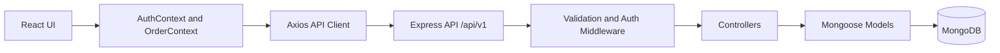

# Laundry Management System


A MERN application for managing laundry orders through a React dashboard and a modular Express API. The repository is organized for clarity first: auth, validation, order workflows, and reporting are separated cleanly so backend behavior stays understandable as the project grows.

## Table of Contents

- [Overview](#overview)
- [Core Features](#core-features)
- [Tech Stack](#tech-stack)
- [High-Level Architecture](#high-level-architecture)
- [Current Scope](#current-scope)
- [Project Structure](#project-structure)
- [Key Technical Challenges and Solutions](#key-technical-challenges-and-solutions)
- [API Documentation](#api-documentation)
- [Database Schema](#database-schema)
- [Engineering Highlights](#engineering-highlights)
- [Installation and Environment](#installation-and-environment)
- [Available Scripts](#available-scripts)

## Overview

This project is split into `client` and `server` applications:

- The frontend is a React + Vite admin interface for login, registration, dashboard metrics, order creation, and order history.
- The backend is an Express 5 API structured around `config`, `routes`, `controllers`, `middlewares`, `validators`, and `models`.
- MongoDB is accessed through Mongoose for persistence and aggregation.
- Frontend state is coordinated through the Context API with `AuthContext` and `OrderContext`.
- Authentication uses JWTs stored on the client and attached to protected API requests.
- Runtime logging is handled by Winston and written to `server/logs`.

## Core Features

- User registration and login with JWT-based authentication.
- Protected dashboard and order management views.
- Order creation with garment line items and server-side total calculation.
- Order history retrieval with optional status and search filters.
- Order status updates across `RECEIVED`, `PROCESSING`, `READY`, and `DELIVERED`.
- Dashboard metrics for total orders, total revenue, and grouped status counts.

## Tech Stack

| Layer | Technologies |
| --- | --- |
| Frontend | React 19, Vite, React Router, Context API, Axios, Tailwind CSS, Framer Motion |
| Backend | Node.js, Express 5, JWT, Zod, Winston, UUID |
| Database | MongoDB, Mongoose |
| Tooling | ESLint, npm scripts, environment-driven configuration |

## High-Level Architecture



### Request Flow

1. The React app initializes inside `BrowserRouter` and is wrapped by `AuthProvider` and `OrderProvider`.
2. `AuthContext` restores the stored session from `localStorage` and exposes login, register, and logout actions.
3. `OrderContext` centralizes order mutations and dashboard reads, keeping data access out of individual pages.
4. The shared Axios instance prefixes requests with `VITE_BACKEND_URL/api/v1` and injects `Authorization: Bearer <token>` when a token exists.
5. Express routes apply request validation and authentication before controller logic runs.
6. Controllers execute business logic such as hashing passwords, generating JWTs, calculating totals, updating statuses, and aggregating dashboard data.
7. Mongoose models persist documents to MongoDB.

### Real-Time Communication

This repository does not currently use WebSockets or Socket.io. State updates are request-driven: the client mutates or fetches data through REST endpoints and updates Context state locally. That tradeoff keeps the implementation simpler today while leaving room for a later real-time layer if live order broadcasting becomes important.

## Current Scope

The documentation below reflects the code that is in this repository now, not the larger prompt-driven feature set captured in [AI_Prompt.md](/Users/ayushraj/Desktop/Project/Laundry/AI_Prompt.md).

Implemented today:

- Auth: register and login
- Orders: create, list, update status
- Dashboard: aggregate totals and status counts
- Frontend: dashboard, order history, protected routes, create-order modal

Not implemented in the current codebase:

- WebSocket updates
- Role-based access control
- Redis, Kafka, or Docker runtime setup
- Pagination, delete order, single-order lookup, or automated delivery-date logic

## Project Structure

```text
.
|-- AI_Prompt.md
|-- AI_uses.md
|-- README.md
|-- client
|   |-- .env.example
|   |-- package.json
|   `-- src
|       |-- components
|       |-- context
|       |-- layouts
|       |-- pages
|       `-- services
`-- server
    |-- .env.example
    |-- package.json
    |-- logs
    `-- src
        |-- config
        |-- controllers
        |-- middlewares
        |-- models
        |-- routes
        `-- validators
```

## Key Technical Challenges and Solutions

| Challenge | Current Solution | Practical Outcome |
| --- | --- | --- |
| Keeping auth logic consistent across the app | Auth responsibilities are centralized in `AuthContext`, backend auth routes, and a shared Axios request interceptor. | Protected calls use one token flow instead of each page reimplementing it. |
| Preventing malformed order payloads from reaching MongoDB | Zod schemas validate auth and order payloads at the route boundary. | Controllers stay focused on business logic, not low-level shape checks. |
| Returning dashboard summaries efficiently | The dashboard endpoint uses MongoDB aggregation for revenue totals and status counts. | The client receives ready-to-render metrics instead of raw order lists. |
| Keeping UI state responsive after writes | `OrderContext` updates local state after create and status-change requests. | The dashboard and order history feel immediate without hard reloads. |
| Supporting a polished interface without heavy UI libraries | Tailwind handles layout and surfaces, while Framer Motion is used for targeted entrance and modal transitions. | The UI stays lightweight and readable. |

## API Documentation

Base URL: `http://localhost:8000/api/v1`

### Auth

| Method | Endpoint | Auth | Description |
| --- | --- | --- | --- |
| `POST` | `/auth/register` | No | Register a new user and return a JWT with safe user data. |
| `POST` | `/auth/login` | No | Authenticate a user and return a JWT. |

### Orders

| Method | Endpoint | Auth | Description |
| --- | --- | --- | --- |
| `POST` | `/orders` | Yes | Create an order from customer and garment payload data. |
| `GET` | `/orders` | Yes | Fetch orders, optionally filtered by `status` and `search`. |
| `PUT` | `/orders/:id/status` | Yes | Update the status of an existing order. |

### Dashboard

| Method | Endpoint | Auth | Description |
| --- | --- | --- | --- |
| `GET` | `/orders/dashboard` | Yes | Return total orders, total revenue, and grouped status metrics. |

### Example Order Payload

```json
{
  "customerName": "Aarav Sharma",
  "phone": "9876543210",
  "garments": [
    { "type": "Shirt", "quantity": 2, "price": 80 },
    { "type": "Suit", "quantity": 1, "price": 250 }
  ]
}
```

### Order Status Enum

`RECEIVED | PROCESSING | READY | DELIVERED`

## Database Schema

### User

```js
{
  name: String,
  email: {
    type: String,
    unique: true
  },
  password: String
}
```

### Order

```js
{
  orderId: String,
  customerName: String,
  phone: String,
  garments: [
    {
      type: String,
      quantity: Number,
      price: Number
    }
  ],
  totalAmount: Number,
  status: {
    type: String,
    enum: ["RECEIVED", "PROCESSING", "READY", "DELIVERED"],
    default: "RECEIVED"
  }
}
```

### Collection Notes

- `users`
  - Stores unique emails and hashed passwords.
- `orders`
  - Stores a generated `orderId`, customer details, embedded garments, computed totals, and workflow status.

## Engineering Highlights

- Engineering-first backend structure with clear boundaries between routing, validation, auth, controller logic, and persistence.
- Versioned API routing through `/api/v1`, which gives future changes a stable namespace.
- Centralized logging through Winston with separate log files for combined and error output.
- Request validation through Zod rather than ad hoc controller checks.
- Context API used deliberately instead of heavier client state tooling because the current state surface is still manageable.
- Documentation aligned to the current repository rather than the broader prompt spec, which makes it safer for onboarding and review.

## Installation and Environment

### Prerequisites

- Node.js 18+
- npm 9+
- MongoDB Atlas or a local MongoDB instance

### 1. Install Dependencies

```bash
cd server
npm install

cd ../client
npm install
```

### 2. Configure Environment Variables

Create local env files from the templates:

```bash
cp server/.env.example server/.env
cp client/.env.example client/.env
```

### Server `.env`

```env
# Server
PORT=8000
NODE_ENV=development

# MongoDB
MONGO_URI=mongodb+srv://<username>:<password>@<cluster-url>/
MONGO_DB_NAME=Laundry

# FRONTEND
FRONTEND_URL=http://localhost:5173

# Auth
JWT_SECRET=replace-with-a-long-random-secret
```

### Client `.env`

```env
VITE_BACKEND_URL=http://localhost:8000
```

### 3. Run the Application

Backend:

```bash
cd server
npm run dev
```

Frontend:

```bash
cd client
npm run dev
```

Default local URLs:

- Frontend: `http://localhost:5173`
- Backend: `http://localhost:8000`

### 4. Production-Oriented Notes

- The backend currently exposes npm-based local startup only.
- There is no checked-in Docker or Compose configuration in this repository.
- CORS behavior depends on `FRONTEND_URL` plus local development origins configured in `server/src/app.js`.

## Available Scripts

### Server

| Command | Description |
| --- | --- |
| `npm run dev` | Start the API with Node's file watcher |
| `npm start` | Start the API without watch mode |
| `npm test` | Placeholder test command |

### Client

| Command | Description |
| --- | --- |
| `npm run dev` | Start the Vite development server |
| `npm run build` | Build the frontend for production |
| `npm run preview` | Preview the production build locally |
| `npm run lint` | Run ESLint |
